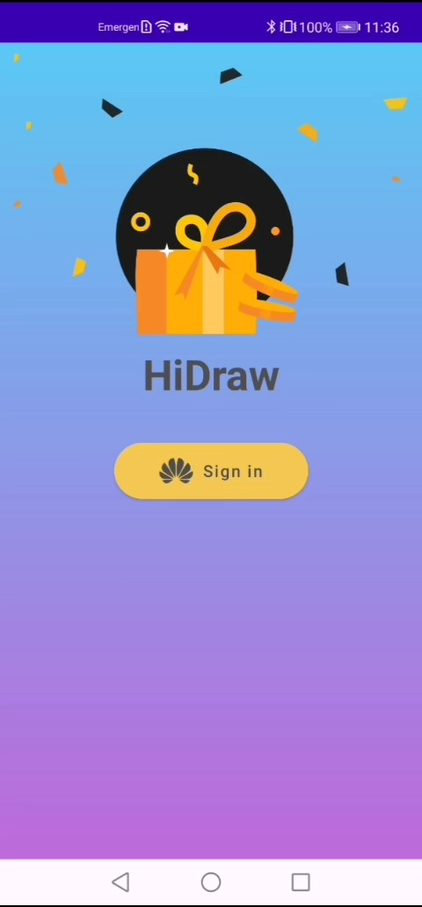
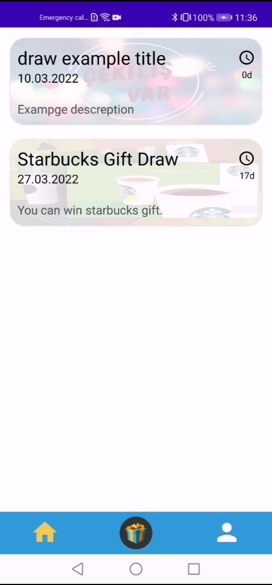
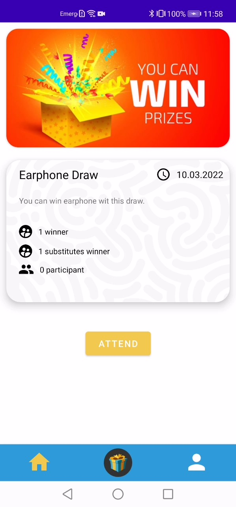
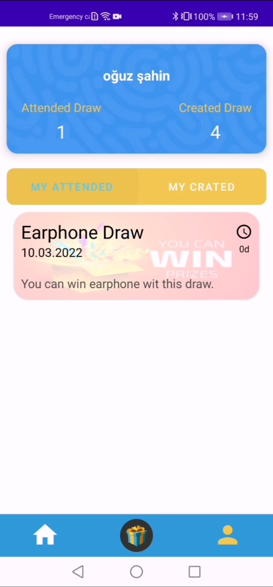
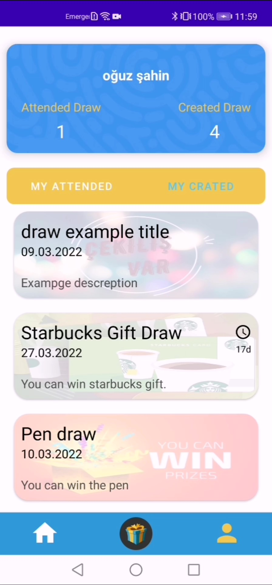
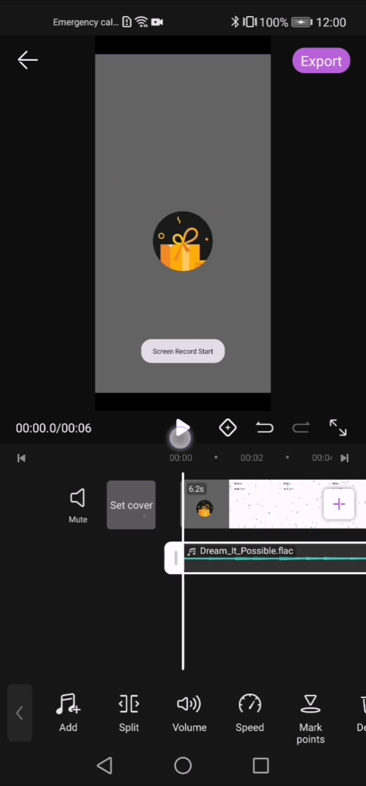
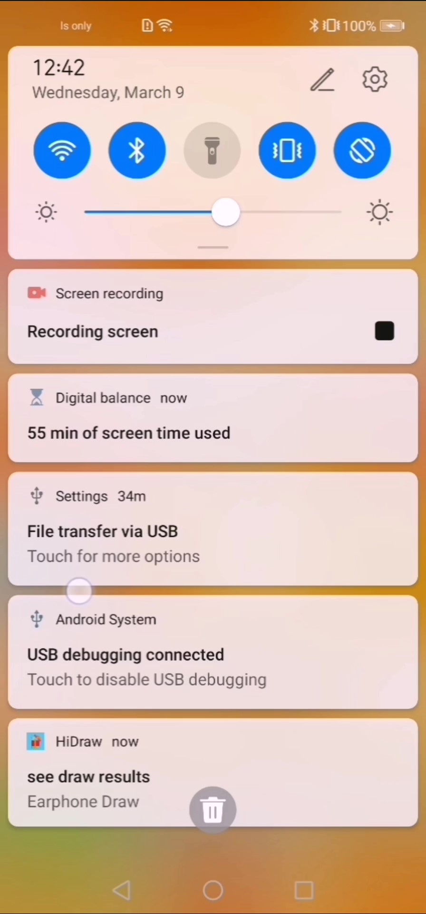

# HiDraw

HiDraw is a reference application for HMS Kits to phones running with the android based
HMS Service. The app obviously is draw application which it provides attend and create draw from [Huawei Developer Forum](https://forums.developer.huawei.com/forumPortal/en/home).
You can attend draw created by someone or you can create new draw according to [Huawei Developer Forum](https://forums.developer.huawei.com/forumPortal/en/home).
The draw result computation according to comments in forum link.
## Screenshots

<table>
<tr>
<td>

</td>

<td>

</td>

<td>

</td>

<td>

</td></tr>

<tr>
<td>

</td>

<td>

</td>

<td>

</td>

<td>

</td></tr>

</table>

# 📱 Features

### Sign in

-----
Thanks to [Account Kit](https://developer.huawei.com/consumer/en/hms/huawei-accountkit/) you
can sign in the app. Also, you can see the profile information in profile page.

https://user-images.githubusercontent.com/51949389/157419256-a08fce50-65eb-4d62-8e82-e3c0c1e4de14.mp4

### Create Draw

-----
You can create a draw from [Huawei Developer Forum](https://forums.developer.huawei.com/forumPortal/en/home) link. You have to fill necessary fields and click create.
Url field should be link from huawei developer topic. Winners is selected this topic comments.  

https://user-images.githubusercontent.com/51949389/157418525-d498ff51-3e30-4f19-bcec-c77b5969add9.mp4

### Attend Draw

-----
You can attend draw that is created by other users and you can obtain the chance to win.

https://user-images.githubusercontent.com/51949389/157418593-480cbc5e-0c6e-455b-931a-307fdf0a0e27.mp4

### Profile Management

-----
You can see the attended and created draw with profile page and manage the draw state.

https://user-images.githubusercontent.com/51949389/157418633-13727454-62e3-483e-8e22-4b164deb5c9b.mp4

### Edit Draw

-----
Thanks to [HUAWEI VIDEO EDITOR KIT](https://developer.huawei.com/consumer/en/hms/huawei-video-editor/) you can edit the screen record and share with participants.

https://user-images.githubusercontent.com/51949389/157418674-55888c4e-7746-4262-8a8a-a2a39f8e1743.mp4

### Learn Winners

-----
Thanks to [HUAWEI PUSH KIT](https://developer.huawei.com/consumer/en/hms/huawei-pushkit/) you can learn the winners that is already your attended draws with notification.

https://user-images.githubusercontent.com/51949389/157418699-e2ad2d50-b2d9-4e10-9c94-a583274fd2d0.mp4

## Tech Stack & Used Kits

This app uses [***MVVM (Model View View-Model)***](https://developer.android.com/jetpack/docs/guide#recommended-app-arch) architecture to have a unidirectional flow of data, separation of concern, and a lot more which is recommended by Google itself.

### Used Kits
✅ [HUAWEI ACCOUNT KIT](https://developer.huawei.com/consumer/en/hms/huawei-accountkit/) \
✅ [HUAWEI VIDEO EDITOR KIT](https://developer.huawei.com/consumer/en/hms/huawei-video-editor/) \
✅ [HUAWEI PUSH KIT](https://developer.huawei.com/consumer/en/hms/huawei-pushkit/) \
✅ [HUAWEI CRASH SERVICE](https://developer.huawei.com/consumer/en/doc/development/AppGallery-connect-Guides/agc-crash-introduction-0000001055732708)     \
✅ [HUAWEI ANALYTICS KIT](https://developer.huawei.com/consumer/en/hms/huawei-analyticskit/)     

### Tech Stack

✅ [Hilt (DI)](https://developer.android.com/training/dependency-injection/hilt-android)     \
✅ [Architecture Components (DataBinding, ViewModel, LiveData)](https://developer.android.com/topic/libraries/architecture/viewmodel)     \
✅ [Coroutines](https://developer.android.com/kotlin/coroutines)     \
✅ [Jetpack Navigation component](https://developer.android.com/guide/navigation)     \
✅ [Airbnb Lottie](https://github.com/airbnb/lottie-android)     \
✅ [Glide](https://github.com/bumptech/glide)     \
✅ [SDP](https://github.com/intuit/sdp) \
✅ [HBRecorder](https://github.com/HBiSoft/HBRecorder)

## Support
Thanks Berkhan Güngör, Dogan Burak Ziyanak, Cengiz Toru for their supports during preparing this repo.

## Licence

    Licensed under the Apache License, Version 2.0 (the "License");
    you may not use this file except in compliance with the License.
    You may obtain a copy of the License at

       http://www.apache.org/licenses/LICENSE-2.0

    Unless required by applicable law or agreed to in writing, software
    distributed under the License is distributed on an "AS IS" BASIS,
    WITHOUT WARRANTIES OR CONDITIONS OF ANY KIND, either express or implied.
    See the License for the specific language governing permissions and
    limitations under the License.
